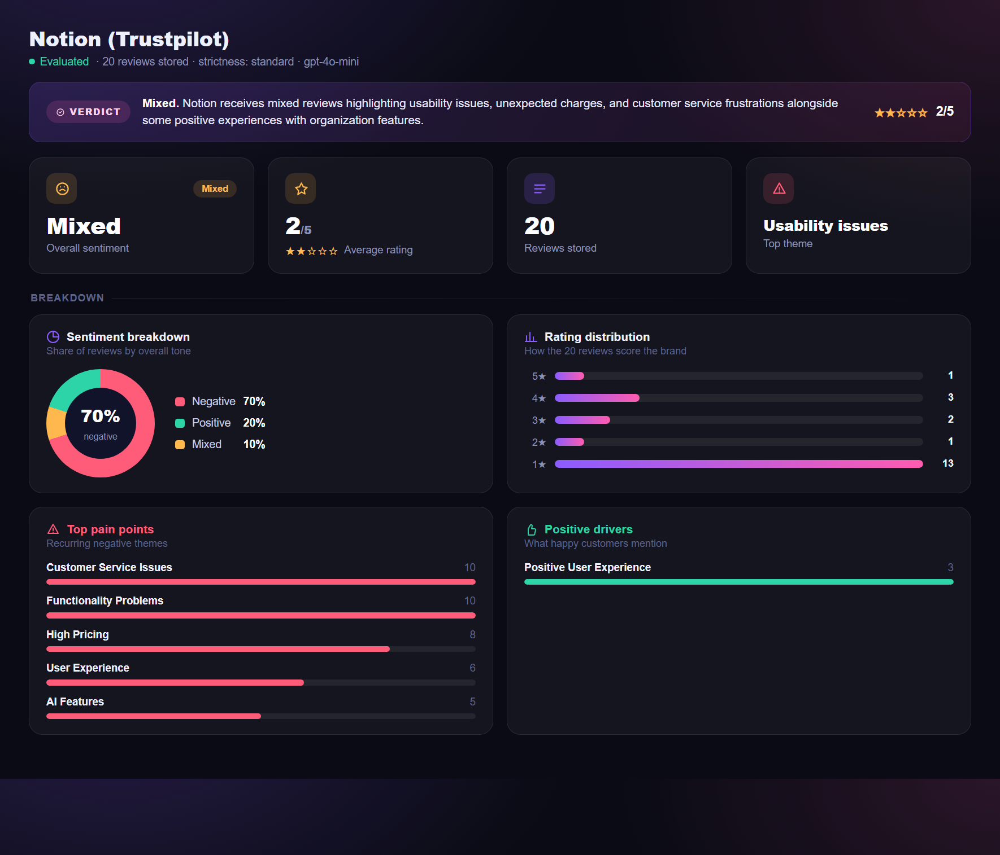

# Review Intelligence Tool

Turn a pile of raw customer reviews into a structured intelligence report a marketing or product team can act on: overall sentiment, a 1 to 5 rating, recurring themes, ranked pain points, positive drivers, and a summary. Built for people who currently read reviews one by one and miss the patterns.

MSIT AI Engineering capstone project.



## What it does

- **Batch evaluation.** Submit reviews under a topic (a company or a product) and one call returns a structured report: sentiment, rating, themes, pain points, positive drivers, and a short and long summary. Output is a validated Pydantic schema, not free text.
- **Review validation gate.** Before anything is stored, an LLM checks that each submission is a genuine review and is on topic. Junk and off topic text are rejected, and prompt injection is blocked: the candidate is wrapped as untrusted data with an explicit instruction never to follow anything inside it (the OWASP approach). Relevance strictness is set per topic (strict, standard, or loose) at creation time.
- **Evaluation Agent.** A function calling chat over the same engine. Name a topic and it looks it up, confirms the match before spending tokens, runs the evaluation, and replies in plain language. Threads are persisted, so the conversation carries context and the verified topic across turns.
- **Multi-model comparison.** The same reviews run through three model families and three prompting techniques, with cost, tokens, and latency logged per run (see Findings below).
- **Dashboard.** A separate Streamlit admin console over the API: the report above, plus topic and review management and the agent.

## Architecture

Three-layer onion, per the architectural guidance of project mentor Stavros. Calls flow strictly inward, and controllers never call repositories directly.

- **Controllers** (`app.py`): HTTP routes only. No business logic, no DB access.
- **Services** (`services/`): business logic, validation, LLM orchestration.
- **Repositories** (`repositories/`): pure SQL only. No logic, no validation; they trust the caller.

SQLite underneath, behind the repository layer, so a later move to Postgres is a swap of one layer rather than a rewrite. Batching parameters (`max_reviews_per_batch`, `max_review_chars`) are config driven (`config.json`), not hardcoded.

## Findings: the model comparison

The analytical core ran the same reviews through four models (OpenAI gpt-4o-mini, Google gemini-2.5-flash-lite, Anthropic claude-haiku-4-5 and claude-sonnet-4-6), three prompting techniques (zero-shot, few-shot, chain-of-thought), three times each: 36 runs, with cost, tokens, and latency captured per run.

- The verdict was **model independent**: every family rated the one-sided Volkswagen topic negative, near 1 of 5.
- **Cheap models matched the premium one**, at roughly a 35x cost spread per run. For this task, model choice is a cost lever, not a quality lever.
- **Chain-of-thought** added cost and latency with no change in the rating.
- Re-running on a balanced topic (Notion) nuanced this: the rating still converged, but the sentiment label split across models and shifted with the prompt technique, showing the "all models agree" result was partly an artifact of an extreme dataset.

## Setup

Requires Python 3.13+ and a virtual environment.

```powershell
python -m venv .venv
.venv\Scripts\activate
pip install -r requirements.txt
copy .env.example .env
# then edit .env and set OPENAI_API_KEY
```

The core tool needs only `OPENAI_API_KEY`. The multi-model comparison also uses `GEMINI_API_KEY` and `ANTHROPIC_API_KEY`.

## Run

```powershell
python app.py
```

Then open <http://localhost:5000>.

## Dashboard (optional)

A separate Streamlit console under `ui/` drives the API over HTTP without touching the core project. It covers topic creation (with the per-topic relevance strictness level), review submission against the validation gate, evaluations with the charts shown above, and the threaded Evaluation Agent.

For a one-click setup, run `install_autostart.bat` once: the tool then starts hidden at every login and serves <http://localhost:8501>, which you bookmark. To launch it manually instead, run `run_ui.bat`. See `ui/README.md` for details and the two-terminal alternative.

## Project layout

```
app.py                 controllers / HTTP routes
services/              business logic, LLM calls, the validation gate and agent
repositories/          SQL only
prompts/ , prompts.py  prompt templates and builders
matrix_runner.py       the multi-model comparison runner
ui/                    Streamlit dashboard (separate app over the API)
docs/                  screenshots and assets
```
